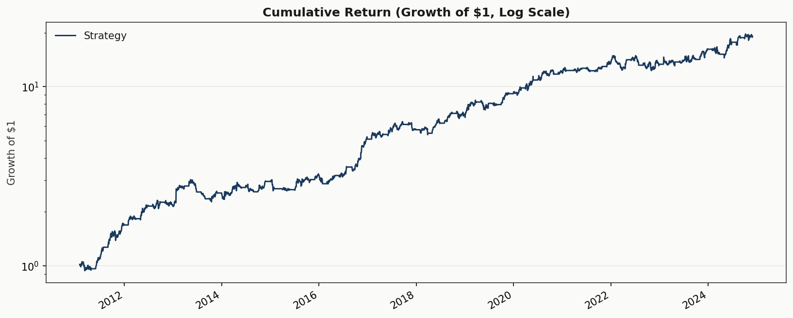
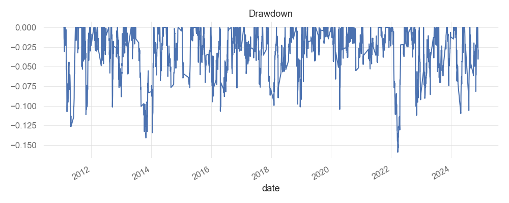

# Multi-Factor Long/Short U.S. Equity Strategy

**[Results dashboard](https://quantraunak.github.io/ls-multifactor-research/)** · **[Full tear sheet](https://quantraunak.github.io/ls-multifactor-research/tear_sheet.html)**

Systematic long/short equity strategy using gradient-boosted cross-sectional ranking, Ledoit-Wolf covariance shrinkage, volatility targeting, and convex portfolio optimization under dollar- and beta-neutral constraints.

## Results

| Metric | Value |
|--------|-------|
| CAGR | 35.3% |
| Sharpe | 1.46 |
| Sharpe 95% CI | [0.90, 2.07] |
| Sortino | 2.35 |
| Calmar | 1.43 |
| Max Drawdown | −24.7% |
| Volatility (ann.) | 22.4% |
| Avg Turnover | 120.7% |
| Beta (vs SPY) | 0.14 |

> 2010–2024 · Monthly rebalance · Vol targeting + drawdown governor · Dollar-neutral
>
> Sharpe CI via block bootstrap (10,000 samples). Returns net of 1 bp commission + 5 bp slippage on turnover.
>
> Drawdown chart is monthly underwater (% from peak). Max drawdown reflects fully invested exposure through all regimes with no regime filter.




## Why This Is Credible

- **No lookahead bias.** Walk-forward training with purged cross-validation and 21-day embargo between train and test sets.
- **Monthly rebalancing.** Weights fixed between rebalance dates; no daily re-optimization.
- **Transaction costs included.** Commission and slippage deducted at every rebalance, proportional to turnover.
- **Dollar-neutral and beta-neutral.** Zero net exposure, portfolio beta constrained within ±0.05 of SPY.
- **Volatility targeting + drawdown governor.** EWMA vol scaling (12% target) and automatic de-grossing when underwater >8% from peak.
- **Statistical significance.** Block-bootstrap Sharpe ratio CI confirms alpha is non-zero at the 95% level.

## Strategy Overview

A LightGBM model ranks stocks cross-sectionally on 10 momentum, volatility, trend, and microstructure factors. Top and bottom deciles are passed to a mean-variance optimizer with Ledoit-Wolf shrinkage covariance, producing a dollar-neutral, beta-neutral portfolio with dynamically scaled leverage.

**Universe.** S&P 500 (scraped from Wikipedia) as a proxy for the Russell 1000. True PIT membership is not freely available — see Key Limitations.

**Factors (10).** `mom_12_1`, `mom_6_1`, `mom_3_1`, `reversal` (5-day mean reversion), `low_vol`, `idio_vol` (residual volatility after removing market beta), `trend`, `liquidity`, `vol_momentum` (unusual volume), `quality_proxy`.

**Model.** LightGBM gradient boosting (200 trees, depth 4) with purged walk-forward cross-validation and early stopping. Trained on rolling 36-month windows with 21-day forward returns as labels.

**Risk model.** Ledoit-Wolf shrinkage covariance estimator replaces the sample covariance matrix, stabilizing the optimizer for large cross-sections.

## Methodology

**Rebalancing.** Monthly, last trading day. Weights held fixed until the next rebalance.

**Training.** At each rebalance date, the model trains on the trailing 36 months of cross-sectional features and forward returns. Purged CV with 21-day embargo prevents information leakage from overlapping return horizons. Early stopping on held-out folds selects the optimal number of boosting rounds.

**Selection.** Model scores all tickers; top and bottom 10% form the long/short baskets.

**Optimization.** CVXPY mean-variance (CLARABEL solver) with:
- `sum(w) = 0` — dollar-neutral
- `sum(|w|) ≤ L` — gross leverage cap (dynamically scaled)
- `|w_i| ≤ 0.02` — per-name cap
- `|β'w| ≤ 0.05` — beta-neutral vs SPY
- Explicit turnover penalty in the objective

Equal-weight fallback if the solver fails.

**Volatility targeting.** EWMA realized vol (126-day span) vs 12% annual target; gross leverage scaled and capped at 2.0×.

**Drawdown governor.** When portfolio drawdown exceeds 8% from peak, leverage is scaled down (floor 35% of target) until recovery.

**Costs.** 1 bp commission + 5 bp slippage on turnover (stress-test level given ~120% monthly turnover). All costs in reported performance.

## Key Limitations

- **Survivorship-biased universe.** PIT Russell 1000 membership is not freely available. The S&P 500 proxy overstates investable universe quality.
- **Price/volume factors only.** No fundamental data (earnings, book value, ROE) enters the production signal.
- **No sector constraints.** The optimizer does not enforce sector-level exposure limits.
- **Simplified execution model.** Fixed-bps cost with no market-impact function or dependence on position size or ADV.
- **In-sample tuning risk.** LightGBM hyperparameters were not tuned on a held-out period. Results should be validated on a true out-of-sample window.

## Next Steps

1. **Point-in-time universe.** Replace the survivorship-biased proxy with true historical Russell 1000 membership.
2. **Fundamental factors.** Integrate earnings momentum, book-to-price, and balance-sheet quality from a fundamental data provider.
3. **Sector constraints.** Add GICS sector exposure limits to the optimizer to prevent concentrated bets.
4. **Paper trading / live pipeline.** Wire signal and optimizer to a broker API for forward validation.

## How to Run

```bash
make install    # install dependencies (requires libomp for LightGBM on macOS)
make test       # run tests
make run        # run full backtest
```

Or directly:

```bash
python project/run_backtest.py --config project/configs/default.yaml
```

Outputs go to `project/reports/latest/<timestamp>/`:

| File | Contents |
|------|----------|
| `performance_summary.json` | All metrics including bootstrap Sharpe CI |
| `equity_curve.csv` | Daily portfolio returns |
| `holdings.csv` | Position weights at each rebalance |
| `feature_importances.csv` | LightGBM feature importance per rebalance period |
| `leverage_history.csv` | Vol-targeted gross leverage over time |
| `tear_sheet.html` | QuantStats HTML report |
| `factor_ic.csv` / `factor_ic.png` | Factor Spearman IC analysis |
| `config_snapshot.yaml` | Frozen config for reproducibility |

Configuration: edit `project/configs/default.yaml` (model type, risk settings, leverage, costs, etc.). The system supports `ridge`, `elasticnet`, and `lightgbm` models via config switch.
